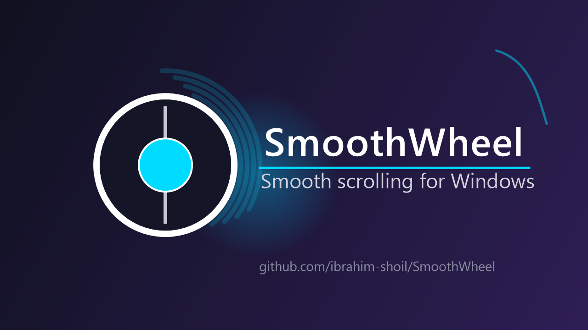

# SmoothWheel




**Smooth, trackpad-style scrolling for a standard mouse wheel on Windows.**

Windows interprets a mouse wheel as discrete "ticks," jumping several lines at a
time — a jarring, choppy experience when reading or browsing, unlike a precision
trackpad. **SmoothWheel** intercepts each tick, suppresses the default jump, and
replays it as an **inertial (momentum) glide** that decelerates naturally. Flick
fast and momentum builds and carries on after you stop — exactly the feel of a
high-end trackpad, the way macOS smooths standard wheel input by default.

> 💡 Zero install required — download the single `.exe`, run it, look in the tray.

---

## ✨ Features

- **Inertial momentum scrolling** — velocity + exponential friction, the same
  model trackpads and macOS use
- **Per-app tuning** — coalescing apps (Firefox, Chrome) get a fine stream;
  synchronous Win32 apps (Explorer, Terminal, Notepad) get a coarser stream so
  they don't drop frames
- **Instant reversal** — scrolling up then down flips immediately, no fighting
- **Instant response** — wakes instantly from idle, so the first flick after
  switching apps starts with zero delay
- **Bounded momentum** — fast scrolling saturates instead of running away
- **System tray app** — toggle, tune, and exit from the tray; `Ctrl+Alt+S` hotkey
- **Start with Windows** — optional autostart via the registry Run key
- **Quiet** — event coalescing + a velocity dead-zone prevent the per-event beeps
  that plague naive smooth-scroll tools
- **Lightweight** — ~0% CPU while idle, fully unhooks when disabled

---

## 📥 Install (no build required)

1. Download **`SmoothWheel.exe`** from the [latest Release](../../releases/latest).
2. Run it. A tray icon appears — you're done. (No installer, no runtime needed.)
3. Scroll in any window — it glides.

> ⚠️ The executable is unsigned. On first run, Windows SmartScreen may show a
> warning ("Windows protected your PC"). Click **More info → Run anyway**. This is
> normal for community-built open-source apps. [Verifying the build](#-build-from-source)
> yourself is always an option.

### From a package manager

Winget/Scoop entries are planned. For now, use the Release download or build from source.

---

## 🖱️ Using it

Right-click the tray icon:

| Menu item | Options | Default |
|---|---|---|
| **Enable smooth scrolling** | on / off (also `Ctrl+Alt+S`) | on |
| **Glide duration** | 60 / 100 / 150 / 200 / 300 / 450 / 600 ms | 150 ms |
| **Precision** | 2 / 4 / 8 / 12 / 16 steps per notch | 12 |
| **Speed** | 1.0 / 1.5 / 2.0 / 2.5 / 3.0× | 1.5× |
| **Max momentum** | 2.0 / 3.0 / 4.0 / 6.0 / 8.0× | 3.0× |
| **Invert direction** | natural-scroll on/off | on |
| **Start with Windows** | autostart on/off | off |
| **Debug logging** | writes `debug.log` (diagnostics) | off |
| **Exit** | | |

Settings persist in `%AppData%\SmoothWheel\config.json`.

---

## 🔧 How it works

| Stage | Detail |
|---|---|
| **Intercept** | A global `WH_MOUSE_LL` hook (`SetWindowsHookEx`) reads each wheel event's delta. |
| **Suppress** | The hook returns non-zero so the OS drops its default "jump N lines" behavior. |
| **Tag own events** | Injected micro-scrolls carry a magic value in `dwExtraInfo`; the hook passes them through unmodified — preventing an infinite re-interception loop. |
| **Inertial glide** | A background thread maintains per-axis **velocity**. Each notch adds a velocity impulse; every frame the velocity is integrated into the scroll position and decayed by **exponential friction** (`v *= friction^dt`). Rapid notches sum impulses → real momentum. |

### Why this feels like a trackpad

- **200 Hz physics** — `timeBeginPeriod(1)` lowers the Windows scheduler tick from
  its default ~15.6 ms to 1 ms, so the loop runs at a real ~200 Hz instead of the
  ~64 Hz a naive `Sleep()` gives. That's the difference between "smooth-ish" and
  "buttery."
- **Per-app emission** — physics stays at 200 Hz, but *injected* events are
  rate-limited: 8 ms (~125 Hz) for apps that coalesce internally (Firefox, Chrome,
  modern XAML), 16 ms (~62 Hz) with bigger deltas for synchronous Win32 renderers
  (Explorer, Terminal) that drop frames under a fast stream.
- **No starvation** — the active-scrolling loop `Sleep()`s (never spin-waits), so
  the hook thread can deliver wheel events promptly even under heavy cursor movement.
- **Instant wake** — an `AutoResetEvent` wakes the animation thread the instant a
  notch arrives, so post-idle response has zero latency.

See [`CHANGELOG.md`](CHANGELOG.md) for the design journey.

---

## 🛠️ Build from source

Requirements: [.NET 10 SDK](https://dotnet.microsoft.com/download) on Windows.

```bat
git clone https://github.com/ibrahim-shoil/SmoothWheel.git
cd SmoothWheel\SmoothWheel
dotnet build -c Release
```

Publish a single, portable, self-contained `.exe` (runs on any Win10/11 x64,
no .NET runtime required on the target machine):

```bat
dotnet publish -c Release -r win-x64 --self-contained true ^
  -p:PublishSingleFile=true -p:IncludeNativeLibrariesForSelfExtract=true ^
  -p:PublishTrimmed=false
```

Output: `SmoothWheel\bin\Release\net10.0-windows\win-x64\publish\SmoothWheel.exe`

---

## 🐛 Troubleshooting

| Symptom | Fix |
|---|---|
| Clicking/buzzing sound while scrolling | Some apps beep per wheel event. Lower **Precision** (e.g. to 4). The dead-zone usually prevents this. |
| Scrolling feels laggy in a specific app | That app renders synchronously. It's on the 16 ms profile; if still choppy, report it (see [Contributing](CONTRIBUTING.md)) so we can add it to the coarse-app list. |
| Lag returns when moving the cursor | Fixed in current builds (sleep-based pacing). If it reappears, file an issue. |
| Scroll goes the "wrong" way | Toggle **Invert direction** in the tray menu. |
| Settings won't persist | Check `%AppData%\SmoothWheel\config.json` is writable. Delete it to reset to defaults. |
| SmartScreen warning on launch | Expected for unsigned apps — **More info → Run anyway**. |

---

## 🤝 Contributing

Contributions welcome! See [`CONTRIBUTING.md`](CONTRIBUTING.md).

Ways to help:
- Report apps that scroll poorly (with the `debug.log` if possible)
- Extend the per-app coarse-rendering list
- Improve the momentum feel
- Add an installer / winget / scoop package

---

## 📄 License

Copyright © 2026 **ibrahim-shoil**. Licensed under the **GNU GPL v3** — see
[`LICENSE`](LICENSE). You may use, modify, and distribute this software freely,
provided derivatives remain GPL-3.0 and open-source.

---

## 🙏 Credits

Built with C# / .NET 10 and the Win32 API (`SetWindowsHookEx`, `SendInput`,
`timeBeginPeriod`, `DWM`). Inspired by the native smooth-scrolling experience on
macOS and precision Windows trackpads.
